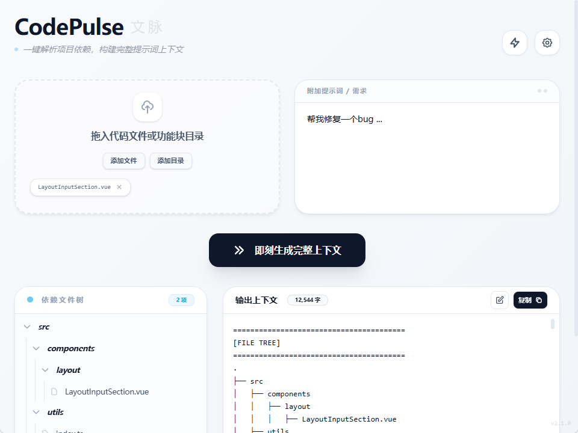
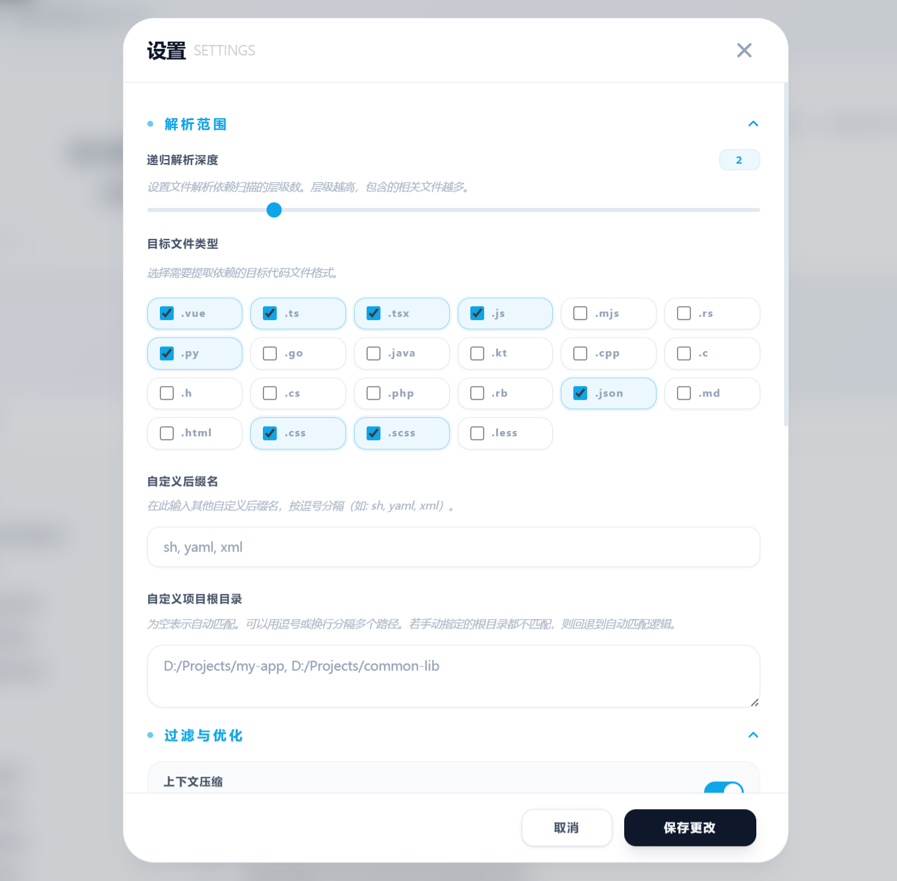

# CodePulse (文脉)



**CodePulse (文脉)** 是一款专为开发者设计的代码上下文构建与自动化辅助工具。它通过自动解析 20 多种编程语言的依赖关系，将零散的代码逻辑汇聚为结构清晰的文本，旨在解决向大语言模型（LLM）提供项目背景时的繁琐工作，帮助 AI 更精准地理解项目逻辑。

除了上下文收集，CodePulse 还能通过注入引导提示词，辅助 AI 生成特定的自动化指令（PulseCommand），从而在本地安全地完成 AI 建议的文件操作方案。**请注意，CodePulse 本身并不集成 AI 功能，其核心定位是作为代码上下文的精准提取器与自动化指令的执行工具。**

[**下载最新版本**](https://github.com/632177447/Code-Pulse/releases)

---

## ✨ 主要功能

- **自动化依赖解析**: 自动识别主流编程语言（TS/JS, Rust, Python, Go, Java, Vue 等）的引用关系，通过递归扫描补全相关代码依赖。
- **结构化上下文**: 自动生成文件树视图和依赖关系说明，并支持为重点文件添加关注标记，帮助 AI 快速构建项目全局认知。
- **精细化内容控制**: 提供多种输出开关，支持行序号显示、路径优化及全局提示词注入；支持**上下文压缩**（移除具体实现）与**大纲模式**（仅保留结构），有效节省 Token 消耗。
- **自动化指令执行**: 内置 PulseCommand 执行窗口，可安全运行由 AI 建议的文件操作指令，辅助完成代码修复与调整（具备严格的路径权限校验）。
- **API 与集成**: 内置本地 RESTful API 服务，提供 Swagger 文档，支持与其他开发工具或自动化流无缝对接。

---

## 🚀 快速上手

### 1. 安装说明
你可以直接从 [GitHub Releases](https://github.com/632177447/Code-Pulse/releases) 下载适合你系统的安装包（支持 Windows、macOS 和 Linux）。

### 2. 使用步骤
1. **基础设置**: 在设置页面配置好递归深度、过滤规则，并确保已配置项目根目录。
2. **添加代码**: 将需要解析的文件或文件夹拖入窗口。
3. **获取上下文**: 点击生成按钮，复制生成的文本发送给 AI 助理。
4. **执行指令**: 若 AI 回复了 PulseCommand 格式的指令，可直接在 CodePulse 的指令窗口一键执行。

<details>
<summary>📸 点击查看界面截图</summary>
<br />
<p align="center">
  
  
</p>
</details>

---

## 🔌 API 接口扩展

为了方便整合进自己的 IDE 或工作流，CodePulse 提供了一套符合 OpenAPI 标准的本地服务。

启动程序后，可通过以下路径查看 Swagger API 文档：
👉 **`http://localhost:<运行端口>/docs`**

目前已开放系统状态、缓存清理、依赖大纲、内容生成及 **PulseCommand 指令执行** 等接口。

---

## 🛠️ 本地开发

### 环境准备
- **Rust**: [安装指南](https://www.rust-lang.org/tools/install) (Tauri 后端驱动)
- **Node.js**: 建议 v18.0 或更高版本
- **包管理器**: npm / yarn / pnpm 均可

### 快速开始
1. **克隆项目**
   ```bash
   git clone https://github.com/632177447/Code-Pulse.git
   cd Code-Pulse
   ```
2. **安装依赖**
   ```bash
   npm install
   ```
3. **启动开发环境**
   ```bash
   npm run tauri dev
   ```

### 打包构建
生成适合当前操作系统的安装包：
```bash
npm run tauri build
```

---

## 🏗️ 技术实现

- **前端框架**: Vue 3 (Composition API)
- **桌面平台**: Tauri 2.0 (Rust)
- **样式体系**: Tailwind CSS (v4)
- **核心逻辑**: 基于正则与语法特征的依赖提取，配合 Rust 实现高效扫描。
- **服务框架**: 基于 Hono 与 Zod 验证，提供标准的 OpenAPI 接口。

---

## 🤝 贡献与反馈

如果你在使用中遇到任何问题，或者有更好的改进建议，欢迎通过以下方式参与：
- 提交 [Issue](https://github.com/632177447/Code-Pulse/issues) 报告 Bug
- 提交 Pull Request 贡献代码

感谢所有为 CodePulse 做出贡献的开发者！

---

## 📄 开源协议

本项目基于 [MIT License](LICENSE) 协议开源。

Copyright (c) 2026 CodePulse Team
