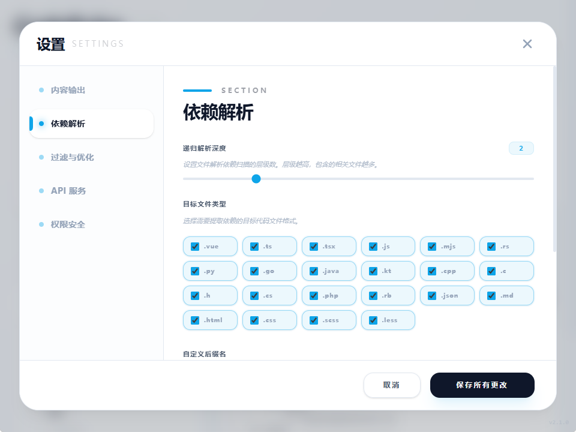

# CodePulse (文脉)


**CodePulse (文脉)** 是一个简单的代码上下文收集工具，旨在帮助开发者更方便地向大语言模型 (LLM) 提供项目代码背景。它支持 20 多种编程语言，可以自动解析文件中的 `import`、`require` 等依赖，并将相关的代码汇聚成一份结构化的文本，方便你粘贴到 AI 聊天窗口中。

[**下载最新版本**](https://github.com/632177447/Code-Pulse/releases)

---

## ✨ 主要功能

- **依赖解析**: 自动识别主流编程语言（TS/JS, Rust, Python, Go, Java, Vue 等）的引用关系，通过递归扫描把相关的代码找齐。
- **文件过滤**: 预设了常用的过滤规则（如 `.git`, `node_modules`, `build` 等），也支持自己配置 Glob 模式和后缀名。
- **性能与控制**: 带有简单的后端文件缓存，重复解析时速度较快，且支持随时中断解析过程。
- **上下文优化**: 提供了一个选项，可以只保留函数或类的定义而移除具体实现，用来节省 Token 消耗。
- **项目结构预览**: 在生成的文本顶部会自动附带一份文件树，让 AI 对项目结构有个直观了解。
- **编辑与统计**: 生成的结果可以直接在框内修改，并实时显示字数，方便二次调整。
- **界面设计**: 基于 Tauri 2.x 和 Vue 3 开发，简洁美观，支持文件拖放操作。
- **API 扩展**: 内置本地 RESTful API 服务，提供 Swagger 接口文档，支持与其他工具无缝集成。

---

## 💡 为什么写这个工具？

在用 ChatGPT 或 Claude 处理复杂一点的代码任务时，往往需要手动把好几个关联文件的内容粘贴过去，非常麻烦。

CodePulse 就是为了解决这个“体力活”。它通过解析代码间的引用关系，把相关的逻辑块自动找出来并整合好。这样即使不使用复杂的 AI Agent，在普通的对话框里也能让 AI 更有针对性地理解你的项目逻辑。

---

## 安装说明

你可以直接从 [GitHub Releases](https://github.com/632177447/Code-Pulse/releases) 下载适合你系统的安装包（支持 Windows、macOS 和 Linux）。

---

## 本地开发

如果你想在本地运行或参与开发，需要先安装 [Rust](https://www.rust-lang.org/) 环境。

1. **克隆项目**:
   ```bash
   git clone https://github.com/your-repo/CodePulse.git
   cd CodePulse
   ```

2. **安装前端依赖**:
   ```bash
   npm install
   ```

3. **启动开发服务器**:
   ```bash
   npm run tauri dev
   ```

### 打包构建

```bash
npm run tauri build
```

---

## 使用步骤

1. **基础设置**: 在设置页面配置好递归深度、过滤规则或项目根目录。
   
   <details>
   <summary>📸 点击查看界面截图</summary>
   <br />
   <p align="center">
     
     
   </p>
   </details>

2. **添加代码**: 把想解析的文件或文件夹拖进去。
3. **补充需求**: 如果有特定的指令，写在附加提示词框里。
4. **生成内容**: 点击生成按钮，等待解析完成。
5. **复制粘贴**: 一键复制结果，发给你的 AI 助理即可。

---

## API 接口扩展

为了方便开发者将代码解析能力整合进自己的 IDE、工作流或自动化脚本中，CodePulse 在后台提供了一套符合 OpenAPI 标准的本地服务。

启动程序后，你可以直接在浏览器或 HTTP 客户端请求以下路径，查看交互式的 Swagger API 文档：
👉 **`http://localhost:<运行端口>/api/v1/ui`**

通过查阅文档，你可以轻松发现所有开放的系统状态、缓存清理、依赖大纲以及内容生成等接口。

---

## 技术实现

- **前端**: Vue 3 (Composition API)
- **桌面端**: Tauri 2.0 (Rust 驱动)
- **样式**: Tailwind CSS
- **解析逻辑**: 基于正则匹配的依赖提取，配合 Rust 实现的高效扫描。
- **API 服务**: 基于 Hono 与 Zod 验证，提供标准的 OpenAPI (Swagger) 接口。

---

## 维护与反馈

如果有 bug 或者新建议，欢迎提 Issue 或 PR，感谢支持。

---

## 开源协议

MIT License | Copyright (c) 2024 CodePulse Team
